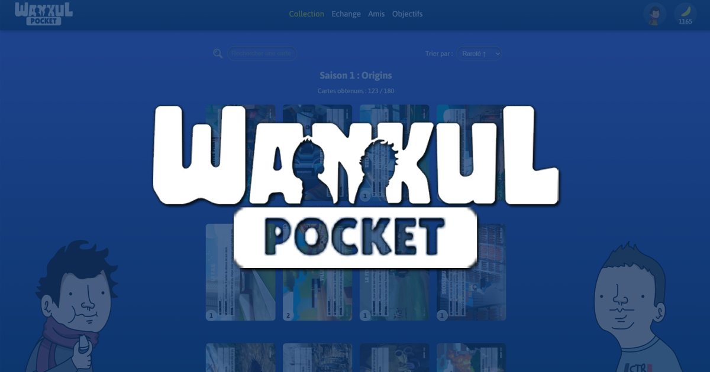

# 🎴 Wankul Pocket

<div align="center">

<p align="center">
  
</p>

**Une application web de collection de cartes Wankul avec système d'échange et d'objectifs**

[](https://nextjs.org/)
[](https://reactjs.org/)
[](https://www.typescriptlang.org/)
[](https://www.mysql.com/)

[🌐 Visiter le site](https://www.wankulpocket.fr/) | [📝 Signaler un bug](https://github.com/Jordan-182/wankul-pocket/issues)

</div>

---

## 📋 Table des matières

- [À propos](#-à-propos)
- [Fonctionnalités](#-fonctionnalités)
- [Technologies](#-technologies)
- [Prérequis](#-prérequis)
- [Installation](#-installation)
- [Configuration](#-configuration)
- [Scripts disponibles](#-scripts-disponibles)
- [Structure du projet](#-structure-du-projet)
- [Base de données](#-base-de-données)
- [API Routes](#-api-routes)
- [Contextes React](#-contextes-react)
- [Composants UI](#-composants-ui)
- [Contribution](#-contribution)
- [License](#-license)
- [Auteurs](#-auteurs)

---

## 🎯 À propos

**Wankul Pocket** est une application web interactive permettant aux fans de Wankul de collectionner des cartes virtuelles, d'ouvrir des boosters, d'échanger avec leurs amis et de compléter des objectifs pour gagner des récompenses.

Le projet s'inspire de l'univers des cartes à collectionner avec une mécanique de gacha et un système social complet.

### Points clés

- 🎴 **Collection de cartes** : Près de 700 cartes réparties sur 4 saisons
- 🎁 **Ouverture de boosters** : Système de drop avec raretés (communes, rares, épiques, légendaires)
- 🤝 **Échanges entre joueurs** : Proposez et acceptez des échanges de cartes
- 👥 **Système d'amis** : Ajoutez des amis via leur ID unique
- 🏆 **Objectifs et quêtes** : Complétez des missions pour gagner des bananes (monnaie du jeu)
- 🔐 **Authentification Google** : Connexion sécurisée via NextAuth
- 🎨 **Design responsive** : Interface optimisée pour mobile et desktop

---

## ✨ Fonctionnalités

### Pour les joueurs

- **Gestion de collection**

  - Visualisation de toutes vos cartes
  - Filtres par saison, rareté, clan
  - Compteur de cartes possédées/manquantes
  - Détection automatique des doublons

- **Ouverture de boosters**

  - 4 boosters différents (Origins, Campus, Battle, Stellar)
  - Animation d'ouverture
  - Système de drop rate réaliste
  - Cartes holographiques rares

- **Système d'échange**

  - Proposition d'échange carte contre carte
  - Validation/refus des échanges
  - Historique des échanges
  - Notifications en temps réel

- **Réseau social**

  - Ajout d'amis via ID unique (format: 0000-0000-0000-0000)
  - Gestion des demandes d'amitié
  - Visualisation des collections d'amis
  - Accès rapide aux échanges depuis le profil ami

- **Système de progression**
  - Quêtes quotidiennes, hebdomadaires et permanentes
  - Récompenses en bananes
  - Statistiques de progression
  - Objectifs variés (amis, échanges, collection)

### Fonctionnalités techniques

- Server-Side Rendering (SSR) avec Next.js 15
- Authentification OAuth 2.0 (Google)
- Gestion d'état avec Context API
- Animations fluides avec Motion
- API REST complète
- Base de données MySQL avec relations complexes

---

## 🛠 Technologies

### Frontend

- **[Next.js 15.3.6](https://nextjs.org/)** - Framework React avec SSR/SSG
- **[React 19.0.1](https://reactjs.org/)** - Bibliothèque UI
- **[TypeScript 5.x](https://www.typescriptlang.org/)** - Typage statique
- **[Motion 12.23.5](https://motion.dev/)** - Animations
- **CSS Modules** - Styles scopés

### Backend & Base de données

- **[Next.js API Routes](https://nextjs.org/docs/api-routes/introduction)** - Backend API
- **[MySQL2](https://github.com/sidorares/node-mysql2)** - Client MySQL pour Node.js
- **[NextAuth.js 4.24.11](https://next-auth.js.org/)** - Authentification

### Outils de développement

- **[ESLint](https://eslint.org/)** - Linter JavaScript/TypeScript
- **[ts-node](https://typestrong.org/ts-node/)** - Exécution TypeScript pour scripts
- **[Turbopack](https://turbo.build/)** - Bundler ultra-rapide

---

## 📦 Prérequis

Avant de commencer, assurez-vous d'avoir installé :

- **Node.js** >= 18.0.0
- **npm** >= 9.0.0
- **MySQL Server** >= 8.0
- Un compte **Google Cloud** (pour l'authentification OAuth)

---

## 🚀 Installation

### 1. Cloner le dépôt

```bash
git clone https://github.com/Jordan-182/wankul-pocket.git
cd wankul-pocket
```

### 2. Installer les dépendances

```bash
npm install
```

### 3. Configurer l'environnement

Copiez le fichier `.env.sample` en `.env` :

```bash
cp .env.sample .env
```

Puis modifiez le fichier `.env` avec vos informations (voir section [Configuration](#-configuration)).

### 4. Initialiser la base de données

```bash
# Créer les tables
npm run db:migrate

# Peupler la base avec les données
npm run db:seed
```

### 5. Lancer le serveur de développement

```bash
npm run dev
```

L'application sera accessible sur [http://localhost:3000](http://localhost:3000)

---

## ⚙️ Configuration

### Variables d'environnement

Créez un fichier `.env` à la racine du projet avec les variables suivantes :

```env
# Base de données MySQL
MYSQL_DB_HOST=localhost
MYSQL_DB_USER=votre_utilisateur
MYSQL_DB_PASSWORD=votre_mot_de_passe
MYSQL_DB_NAME=wankul_pocket

# Configuration Next.js
NEXT_PUBLIC_API_URL=http://localhost:3000

# NextAuth.js
NEXTAUTH_SECRET=votre_secret_aleatoire_tres_long

# Google OAuth
GOOGLE_CLIENT_ID=votre_client_id.apps.googleusercontent.com
GOOGLE_CLIENT_SECRET=votre_client_secret

# Cron (pour les tâches planifiées)
CRON_SECRET=votre_cron_secret

# CORS
ALLOWED_ORIGIN_LOCAL=http://localhost:3000
ALLOWED_ORIGIN_PROD=https://www.wankulpocket.fr
```

### Configuration Google OAuth

1. Rendez-vous sur [Google Cloud Console](https://console.cloud.google.com/)
2. Créez un nouveau projet ou sélectionnez un projet existant
3. Activez l'API Google+
4. Créez des identifiants OAuth 2.0
5. Ajoutez les URI de redirection autorisées :
   - `http://localhost:3000/api/auth/callback/google` (développement)
   - `https://www.wankulpocket.fr/api/auth/callback/google` (production)
6. Copiez le Client ID et Client Secret dans votre `.env`

---

## 📜 Scripts disponibles

```bash
# Développement avec Turbopack
npm run dev

# Build de production
npm run build

# Démarrer en production
npm run start

# Linter
npm run lint

# Migration de la base de données
npm run db:migrate

# Seed de la base de données
npm run db:seed
```

---

## 📁 Structure du projet

```
wankul-pocket/
├── public/                      # Assets statiques
│   ├── booster/                # Images des boosters
│   ├── saison1/ à saison4/     # Images des cartes
│   ├── horsSerie/              # Cartes hors-série
│   ├── Laink/                  # Assets Laink
│   ├── Terracid/               # Assets Terracid
│   └── profilpic/              # Photos de profil
├── script/                      # Scripts de base de données
│   ├── migrate.ts              # Création du schéma
│   ├── seed.ts                 # Insertion des données
│   └── README.md               # Documentation scripts
├── src/
│   ├── app/                    # Pages Next.js (App Router)
│   │   ├── api/                # API Routes
│   │   │   ├── auth/           # NextAuth endpoints
│   │   │   ├── boosters/       # Endpoints boosters
│   │   │   ├── cards/          # Endpoints cartes
│   │   │   ├── friends/        # Endpoints amis
│   │   │   ├── profilpictures/ # Endpoints avatars
│   │   │   └── users/          # Endpoints utilisateurs
│   │   ├── amis/               # Page gestion des amis
│   │   ├── booster/            # Page sélection booster
│   │   ├── collection/         # Page collection
│   │   ├── echange/            # Page échanges
│   │   ├── objectifs/          # Page objectifs/quêtes
│   │   ├── profil/             # Page profil utilisateur
│   │   ├── landingpage/        # Page d'accueil publique
│   │   ├── legal/              # Mentions légales
│   │   └── apropos/            # Page à propos
│   ├── context/                # Contextes React
│   │   ├── CollectionContext.tsx
│   │   ├── FriendListContext.tsx
│   │   ├── OpenedCardsContext.tsx
│   │   ├── QuestProgressContext.tsx
│   │   └── UserContext.tsx
│   ├── data/                   # Données statiques
│   │   ├── wankulBoosters.json
│   │   ├── wankulCards.json
│   │   ├── wankulCardsS2.json
│   │   ├── wankulCardsS3.json
│   │   ├── wankulCardsS4.json
│   │   ├── wankulCardsHS.json
│   │   ├── wankulQuests.json
│   │   ├── wankulList.ts
│   │   ├── avatarList.ts
│   │   ├── formMessages.ts
│   │   ├── responseMessages.ts
│   │   └── ROUTES.ts
│   ├── lib/                    # Fonctions utilitaires & DB
│   │   ├── db.ts               # Pool de connexion MySQL
│   │   ├── checkUserAuth.ts
│   │   ├── collection/         # Logique collection
│   │   ├── friends/            # Logique amis
│   │   ├── openBooster/        # Logique boosters
│   │   ├── quest/              # Logique quêtes
│   │   ├── trade/              # Logique échanges
│   │   └── user/               # Logique utilisateurs
│   ├── model/                  # Types TypeScript
│   │   ├── UserModel.ts
│   │   ├── CardsModel.ts
│   │   ├── BoosterModel.ts
│   │   ├── TradeModel.ts
│   │   ├── QuestModel.ts
│   │   └── ...
│   ├── service/                # Couche service
│   │   ├── UserService.ts
│   │   ├── BoosterService.ts
│   │   ├── CollectionService.ts
│   │   ├── TradeService.ts
│   │   ├── FriendsService.ts
│   │   └── QuestService.ts
│   ├── ui/                     # Composants UI
│   │   ├── Header.tsx
│   │   ├── Tapbar.tsx
│   │   ├── BoosterSelection.tsx
│   │   ├── CardModal.tsx
│   │   ├── CollectionContainer.tsx
│   │   ├── DisplayFriendList.tsx
│   │   └── ...
│   └── utils/                  # Utilitaires
│       ├── authOptions.ts
│       ├── cardSelectionUtils.ts
│       ├── QuestValidator.ts
│       └── ...
├── .env.sample                 # Exemple de configuration
├── .gitignore
├── eslint.config.mjs
├── next.config.ts              # Configuration Next.js
├── package.json
├── tsconfig.json               # Configuration TypeScript
└── README.md
```

---

## 🗄️ Base de données

### Schéma de la base de données

Le projet utilise MySQL avec les tables suivantes :

- **`user`** : Informations utilisateurs (email, username, bananas, profil_picture_id, profil_id)
- **`profil_picture`** : Images de profil disponibles
- **`booster`** : Définition des boosters (nom, image, saison)
- **`card`** : Catalogue de toutes les cartes (nom, rareté, clan, drop_rate, quote, etc.)
- **`collection`** : Association user ↔ card avec quantité
- **`is_friend`** : Relation d'amitié entre utilisateurs (avec statut et validation)
- **`exchange`** : Propositions d'échange entre utilisateurs
- **`quest`** : Définition des objectifs (mission, reward, category, goal_target)
- **`completed_quests`** : Quêtes terminées par utilisateur

### Migration et Seed

```bash
# Créer toutes les tables
npm run db:migrate

# Insérer les données initiales (cartes, boosters, quêtes)
npm run db:seed
```

> ⚠️ **Important** : Le seed maintient toujours un booster fictif avec l'ID 0 pour les cartes hors-série. Ne jamais supprimer ce booster !

---

## 🔌 API Routes

### Authentification

- `POST /api/auth/signin` - Connexion Google OAuth
- `POST /api/auth/signout` - Déconnexion

### Utilisateurs

- `GET /api/users` - Récupérer un utilisateur
- `PATCH /api/users` - Mettre à jour un utilisateur

### Boosters

- `GET /api/boosters` - Liste des boosters
- `POST /api/boosters/open` - Ouvrir un booster

### Cartes

- `GET /api/cards` - Liste des cartes
- `GET /api/cards/[id]` - Détails d'une carte

### Collection

- `GET /api/collection` - Collection de l'utilisateur

### Amis

- `GET /api/friends` - Liste des amis
- `POST /api/friends` - Envoyer une demande d'ami
- `PATCH /api/friends` - Accepter/refuser une demande
- `DELETE /api/friends` - Supprimer un ami

### Échanges

- `GET /api/trades` - Liste des échanges
- `POST /api/trades` - Créer une proposition
- `PATCH /api/trades` - Accepter/refuser un échange
- `DELETE /api/trades` - Annuler un échange

---

## 🧩 Contextes React

Le projet utilise l'API Context pour la gestion d'état globale :

- **`UserContext`** : Informations utilisateur connecté (username, email, bananas, etc.)
- **`CollectionContext`** : État de la collection (cartes possédées, filtres)
- **`FriendListContext`** : Liste des amis et demandes en attente
- **`OpenedCardsContext`** : Cartes obtenues lors de l'ouverture d'un booster
- **`QuestProgressContext`** : Progression des objectifs

---

## 🎨 Composants UI

Quelques composants clés :

- **`BoosterSelection`** : Sélection et ouverture de boosters avec animation
- **`CollectionContainer`** : Affichage de la collection avec filtres et recherche
- **`CardModal`** : Modal de détails d'une carte (quote, rareté, statistiques)
- **`DisplayFriendList`** : Liste des amis avec actions (voir collection, proposer échange)
- **`HomepageTrade`** : Widget d'échanges sur la homepage
- **`DisplayQuests`** : Liste des objectifs avec progression
- **`BananaLoader`** : Animation de chargement personnalisée

---

## 📄 License

Ce projet est sous licence privée. Tous droits réservés.

---

## 👥 Auteurs

- **[Jordan-182](https://github.com/Jordan-182)**, **[Salvak613](https://github.com/Salvak613)**, **[Salah-hnt](https://github.com/salah-hnt)** - Développeurs
- Inspiré par l'univers **Wankul** de **Laink** et **Terracid**

---

## 🙏 Remerciements

- La communauté **Wankul** pour le soutien
- **[J_Maniak](https://www.twitch.tv/j_maniak)** pour l'accompagnement pédagogique initial
- **Next.js Team** pour le framework
- Tous les contributeurs du projet

---

<div align="center">

**Fait avec ❤️ pour la communauté Wankul**

[⬆ Retour en haut](#-wankul-pocket)

</div>
